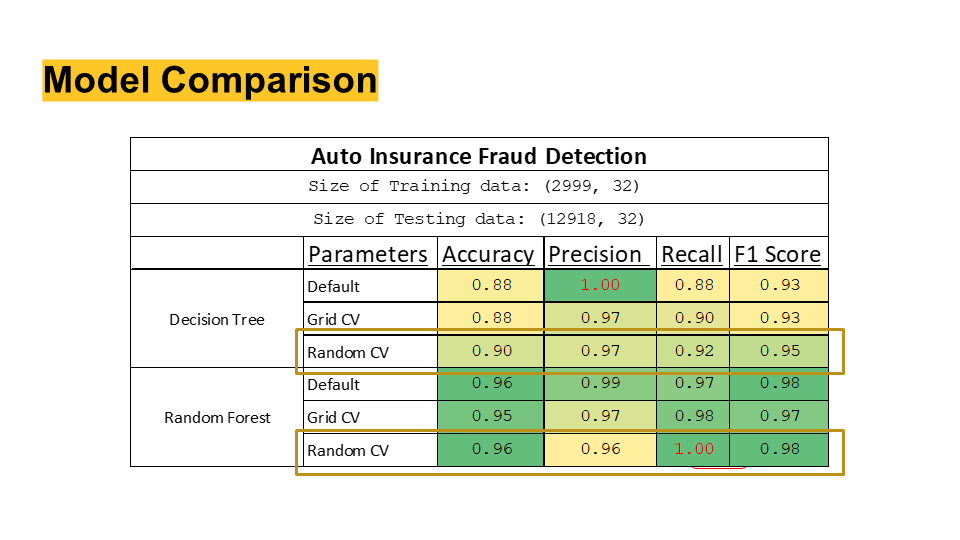
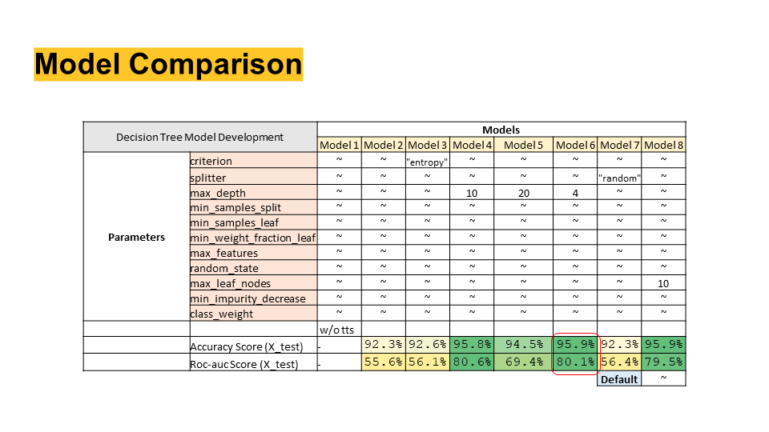
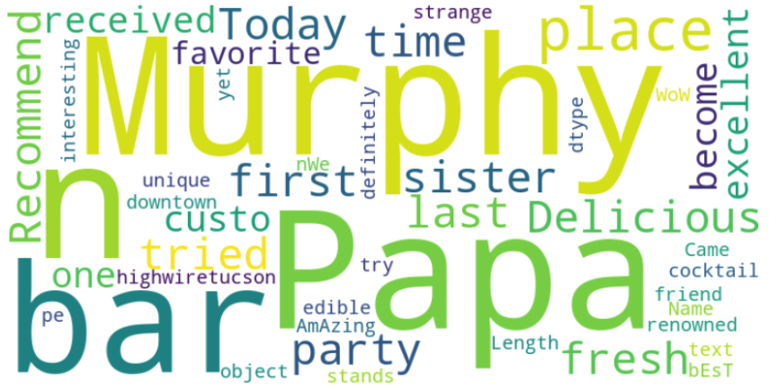
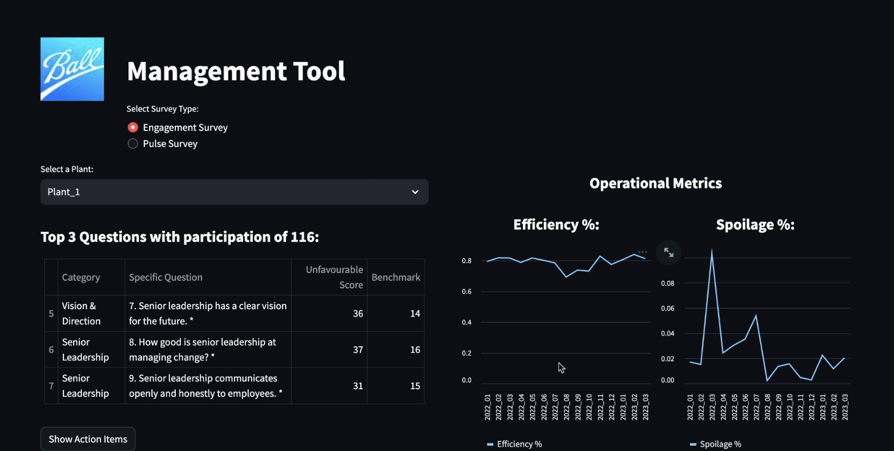

# Portfolio
---
## Supply Chain Analytics 

### <ins>Master's Capstone Project</ins>: *"Predicting Shipping Time/Transit Time to show ​ETA/ETD for shipments using Machine Learning models"*  

_Key Skills: Python (Random Forest, Gradient Boosting, Neaural Nets, Streamlit), Supply Chain, Data Analysis_

I am led a comprehensive <b>end-to-end project</b> along with 4 graduates, culminating in a Streamlit app to forecast ETA/ETD for ocean shipments, enhancing supply chain visibility. 
Key achievements till now:
<li> Analyzed data from 3 customers, covering <b>54k shipments</b> and <b>211 routes</b>.</li>
<li> Enhanced the predictive model with static (e.g., holidays) and dynamic factors (e.g., port congestion, weather disruptions).</li>
<li> Conducted EDA using Tableau, evaluating <b>23 carriers</b> across various routes.</li>
<li> Developed a machine learning model (employing algorithms such as Random Forest, Gradient Boosting, MLR, and Neural Networks) with an <b>R2 score</b> of <b>0.78</b>, demonstrating high predictive accuracy.</li>
<li> Successfully deployed a Streamlit application showcasing the model's capability to predict shipment times accurately, improving operational efficiency in logistics.</li>

 

 

---

### Sustainability Metrics: Offering Insights into Decision-Making Parameters

_Key Skills: Python (Pandas, NumPy, Matplotlib, Seaborn)_

This Python project explores sustainability metrics within supply chain data, offering insights into decision-making parameters. 
<b>Key Features:</b> 

<li><b>Delivery Time and Late Delivery Rate:</b> Evaluates average days for shipping, scheduled shipment times, and late delivery rates to assess efficiency and customer satisfaction.</li>

<li><b>Profitability and Efficiency:</b> Measures benefit per order, order profit per order, and order item profit ratio to gauge economic sustainability and profitability.</li>

<li><b>Resource Utilization:</b> Identifies the customer segment generating the most sales and analyzes order item quantities for demand and inventory management.</li>

<li><b>Shipping Modes:</b> Examines the distribution of orders across different shipping modes to identify opportunities for sustainable shipping options.</li>

<li><b>Geographical Analysis:</b> Analyzes markets and regions where orders are delivered, helping optimize distribution and reduce transportation emissions.</li>

<li><b>Order Status Analysis:</b> Measures the distribution of order statuses to identify trends related to order fulfillment and customer satisfaction.</li>

 

---

## Deep Learning/ LLM 

### NewsPulse AI: User-frinedly News Research Tool

_Key Skills: LLM, LangChain, OpenAI_

<b>NewPulse AI</b> is a user-friendly news research tool designed for effortless information retrieval. Users can input article URLs and ask questions to receive relevant insights from the stock market and financial domain. 

<b>Features:</b> 

<li>Load URLs or upload text files containing URLs to fetch article content.</li>
<li>Process article content through <b>LangChain's UnstructuredURL Loader</b></li>
<li>Construct an embedding vector using <b>OpenAI's embeddings</b> and leverage <b>FAISS</b>, a powerful similarity search library, to enable swift and effective retrieval of relevant information</li>
<li>Interact with the LLM's (Chatgpt) by inputting queries and receiving answers along with source URLs.</li>

 

 
---

## Machine Learning

### Fraud Detection Using Predictive Analytics

_Key Skills: Classification, Fraud Detection, Random Forest, OneHotEncoder, getdummies, labelencoder_

A large number of problems in data mining are related to fraud detection. Fraud is a common problem in auto insurance claims, health insurance claims, credit card transactions, financial transaction and so on. The data in this particular case comes from an actual auto insurance company. Each record represents an insurance claim. The last column in the table tells you whether the claim was fraudulent or not. 
<b>Learnings :</b> 
<li><b>Dealing with categorical data:</b> OneHotEncoder, getdummies, labelencoder </li>
<li>HyperParameter Tuning using GridSearch and RandomSearch Methods</li>
<li>Building a Random Forest Classifier</li>
<li><b>Model Evaluation :</b> More focus on False Negatives</li>

 

 

---
### Santander Customer Satisfaction: A Kaggle Competition

_Key Skills: Decision Tree Classification, Random Forest, Support Vector Machine, Naive Bayes, Logistic Regression_

From frontline support teams to C-suites, customer satisfaction is a key measure of success. Unhappy customers don't stick around. What's more, unhappy customers rarely voice their dissatisfaction before leaving. 

Santander Bank is asking Kagglers to help them identify dissatisfied customers early in their relationship. Doing so would allow Santander to take proactive steps to improve a customer's happiness before it's too late. 
In this project, we work with hundreds of anonymized features to predict if a customer is satisfied or dissatisfied with their banking experience. 

You are provided with an anonymized dataset containing a large number of numeric variables. The "TARGET" column is the variable to predict. It equals one for unsatisfied customers and 0 for satisfied customers. 
The task is to predict the probability that each customer in the test set is an unsatisfied customer. 
We implement a decision tree classifier model from the Scikit-learn library to predict the class. We will initially evaluate the default decision tree model and step by step explore differnent parameters of the decision tree classifier to improve the model. 
<b>Learnings:</b>  
<li>Building a Classification model using Decision Tree Classfier</li>
<li>Manually tuning ML Models for better accuracy and ROC score</li>  
<li>Model Evaulation using Accuracy, Precision, Recall and ROC curves</li> 

 

 

---
### Homesite Quote Conversion

_Key Skills: Classification, Linear SVC, Random Forest, KNN Classifier, MLP Classifier_

This dataset represents the <b>activity of a large number of customers</b> who are interested in buying policies from Homesite. Each QuoteNumber corresponds to a potential customer and the QuoteConversion_Flag indicates whether the customer purchased a policy.  
The provided features are anonymized and provide a rich representation of the prospective customer and policy. They include specific coverage information, sales information, personal information, property information, and geographic information. Your task is to predict <b>QuoteConversion_Flag</b> for each QuoteNumber in the test set.

---

## Natural Language Processing

### Analysis of Restaurant Reviews and Ratings in AZ using Yelp Data

_Key Skills: Python (spaCy, NLTK, Bert), WordCloud_

The Yelp Dataset <b>“reviews.json”</b> and <b>“business.json”</b> has  reviews and ratings for all different kind of business present all around United States. For this analysis we will be focusing on restaurants businesses in our home state of Arizona. We want the restaurants of AZ to know how the ratings and review will affect their sales in a long term. 
<b>Topic:</b> Focused on extracting meaningful patterns and trends from the business and review tables, targeting restaurants in Arizona. 
<b>Objective:</b> Helped restaurants understand customer preferences using sentiment analysis, topic extraction, and ML models like regression and classification.

 

 

---
## Data Visualization

### AIRBNB Review Analytics: Exploring Amsterdam's Hosting Landscape

_Key Skills: Tableau, Interactive Visualization, Data Analysis_

In our SQL project, "Airbnb Reviews Analytics," we embarked on a data-driven journey through the vibrant city of Amsterdam. Recognizing the challenges of web scraping, we harnessed the power of data from  to gain unique insights into the Airbnb ecosystem. 
Our focal point was Amsterdam, a city close to our hearts, and we delved into its rich dataset from a diverse pool of options. 

<b>Business Problems Addressed</b> 

<b>Question 1: Unlocking Airbnb Success Stories</b> 
As a passionate enthusiast and key business stakeholder, our primary goal was to understand how Airbnb hosts were performing in Amsterdam. We sought answers to the question: "How much are the top Airbnb owners making in Amsterdam?" This insight provides a glimpse into the lucrative world of short-term rentals. 

<b>Question 2: Catering to a Niche Market</b> 
With a long-standing desire to establish an Airbnb Cleaning Business, we embarked on a quest to identify potential customers. By dissecting the data, we aimed to answer the question: "Who comprises the potential customer list for our Airbnb Cleaning Business?" This critical knowledge forms the foundation for our future entrepreneurial endeavors. 
Join us as we unveil the intriguing world of Amsterdam's Airbnb landscape, providing data-driven answers to these pressing questions and shedding light on opportunities for entrepreneurial success.

 

 

---
## People Analytics

### IOWA Business Analytics Case Competition: Ball Corporation Organizational Health

_Key Skills: Python, Streamlit, People Analytics_

In our presentation for <b>Ball Corporation</b>, my team and I, delivered a detailed <b>strategic blueprint</b> aimed at boosting the organization's health across several key areas. We started by identifying current challenges like <b>high turnover rates</b> and <b>inconsistent efficiency patterns</b>. We then proposed a holistic approach to manufacturing excellence that includes enhancing efficiency through lean manufacturing, improving safety through strict compliance with OSHA standards, elevating product quality via robust quality management systems, and developing a skilled workforce through continuous training. Our strategic recommendations leveraged innovative technologies such as smart automation and predictive maintenance to drive operational excellence. 
We also highlighted workforce optimization strategies, like adopting a lifetime employment model and gamifying KPIs, to increase engagement and performance. Our phased implementation plan is designed to stabilize work expectations, enhance safety, and foster a culture of continuous learning, ultimately decreasing turnover and boosting operational efficiency. 

 

 

© 2024 Bhumit Sheth 

